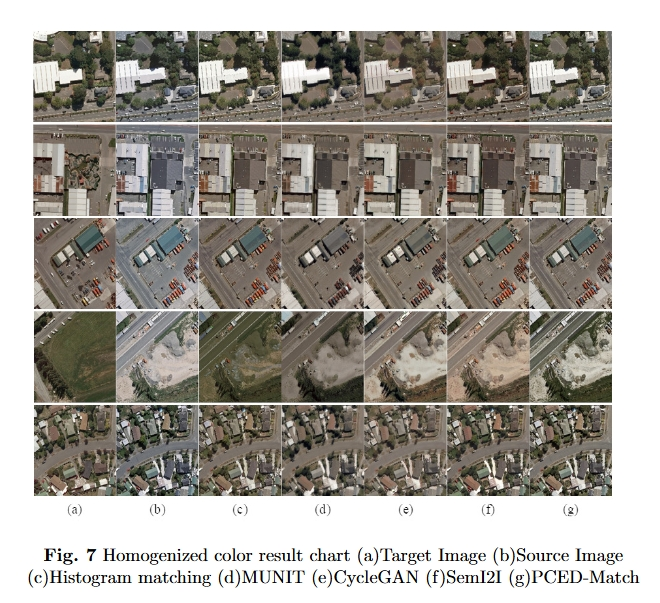
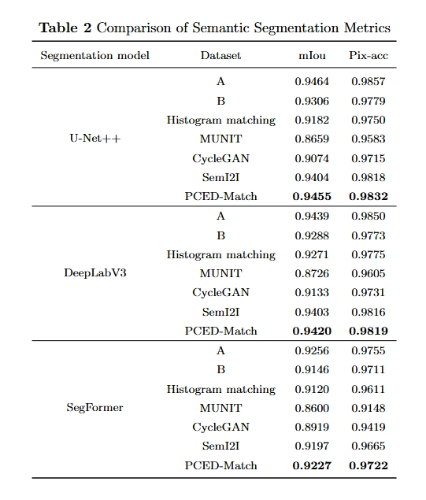

# Principal Color Extraction and Decomposition for Enhanced Remote Sensing Image Homogenization

This project realized the method of homogenize color of 2016 image reference 2012 image in Building Change Detection Dataset

## Paper
Principal Color Extraction and Decomposition for Enhanced Remote Sensing Image Homogenization <br />
Yu-Shun Zhao and Yi Sui <br />The Visual Computer.

Please cite our paper if you find it useful for your research.

```
@article{PCED_Match_2018,
  author = {Y.-S. Zhao and Y Sui},
  booktitle = {The Visual Computer},
  title = {Principal Color Extraction and Decomposition for Enhanced Remote Sensing Image Homogenization},
  year = {2025}
}
```

## Experiment Results



## Quantitative Reuslts



## Installation
* Install PyTorch from http://pytorch.org with Python 3.7 and CUDA11.3
* PyTorch 1.12 with Python 3.7 and CUDA 11.3
* Clone this repo
```
git clone https://github.com/zhaoyushun1023/PCED-Match
cd PCED-master
```
## Dataset
* Download the [Places365- Standard Dataset](https://paperswithcode.com/dataset/places365) as training dataset, crop it to a 256 by 256 pixel image without overlap, and put them in the `dataset/val` folder

* Download the [Building Change Detection Dataset](http://gpcv.whu.edu.cn/data/Building%20change%20detection%20dataset_add.zip) as test dataset, crop it to a 512 by 512 pixel image without overlap, and put it in the `dataset/building_change_detection` folder

## Train
* Configure the pyTorch virtual environment
  
* Crop the downloaded training dataset and place it in the specified location

* Execute the following commands to train the PCED model

  ```
  python train.py
  ```

* After training, the model is saved to folder `train_results/2016to2012/new_model` 

## Test
* Crop the downloaded test dataset and place it in the specified location
* Execute the following commands to test 

```
python test.py
```

* The resulting image is saved to folder `test_results/images`

* Compute the Spectral mapping Angle (SAM), root mean square error (RMSE), structural similarity (SSIM), peak signal-to-noise ratio (PSNR) between the resulting image and the reference image
```
python calculate.py
```
